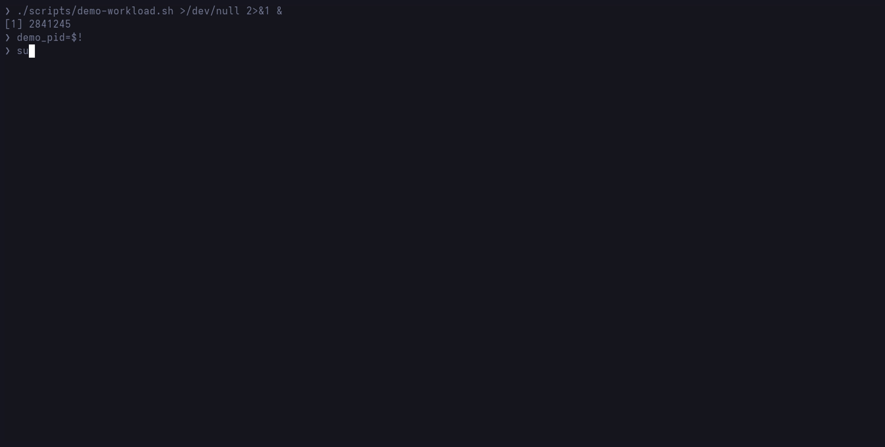

# ncda

`ncda` is an ncdu-like terminal monitor for live Linux file I/O. It uses eBPF to show system-wide reads and writes by path and process, either in an interactive TUI or as periodic text output.

Built with [Aya](https://aya-rs.dev/) and [Ratatui](https://ratatui.rs/).



The demo uses real eBPF events. It can be reproduced with [`docs/demo.tape`](docs/demo.tape) and [`scripts/demo-workload.sh`](scripts/demo-workload.sh).

## Install

### Homebrew on Linux

```bash
brew install angristan/tap/ncda
```

The formula installs both `ncda` and `ncda-bench` on Linux x86_64 and ARM64.

### Nix

Run the source-built package without installing it:

```bash
nix run github:angristan/ncda -- --version
```

Install it into a user profile:

```bash
nix profile install github:angristan/ncda
```

For a declarative NixOS configuration, add ncda as a flake input:

```nix
inputs.ncda.url = "github:angristan/ncda";
```

Then include its package where `inputs` is available:

```nix
environment.systemPackages = [
  inputs.ncda.packages.${pkgs.system}.default
];
```

The flake builds `ncda` and `ncda-bench` from the committed Rust source and
`Cargo.lock`. It supports native Linux ARM64 and x86_64 builds. The consumer's
lock file pins ncda's tested Nixpkgs and rust-overlay revisions. Advanced
configurations can make its Nixpkgs input follow the host after verifying that
LLVM 22 and the pinned Rust toolchains remain available.

### Prebuilt binaries

Release archives, SHA-256 checksums, and build provenance are available on the [releases page](https://github.com/angristan/ncda/releases).

## Run

```bash
sudo ncda                         # interactive TUI
sudo ncda --stdout                # periodic text summary
sudo ncda --rate-window 10        # 10-second rolling rates
sudo ncda --exclude /var/cache    # repeatable path exclusion
```

Press `?` in the TUI for keybindings and filter syntax. By default, `/proc`, `/sys`, and `/dev` are excluded.

`ncda` reports successful reads and writes that transferred data. Failed calls, zero-byte calls, attribution failures, and capture loss remain visible as diagnostics. Ambiguous paths are placed under `/[unresolved]/` rather than assigned to a plausible but incorrect file.

See [Capture model](docs/capture-model.md) for syscall coverage, path attribution, and loss semantics.

## Requirements

- Linux 6.1 or newer
- Native x86_64 or AArch64 userspace
- Root, or `CAP_BPF` + `CAP_PERFMON` (`CAP_SYS_PTRACE` may be needed for path resolution)

The syscall decoder intentionally ignores x86 ia32/x32 and ARM AArch32 compatibility calls. Startup errors include the detected capabilities, kernel lockdown state, and memory-lock limits when eBPF initialization fails.

## Build from source

```bash
rustup toolchain install 1.97.1
rustup toolchain install nightly-2026-08-04 --profile minimal --component rust-src
cargo install bpf-linker --version 0.11
cargo build --release --locked --bins
```

The eBPF nightly is pinned because its LLVM version must match `bpf-linker` 0.11.

Nix users can enter a shell containing both pinned Rust toolchains and the
matching linker:

```bash
nix develop
cargo build --release --locked --bins
```

## Development

```bash
cargo fmt --all -- --check
cargo clippy --locked --all-targets -- -D warnings
cargo test --locked
cargo build --release --locked --bins
nix flake check --no-update-lock-file
scripts/test-ebpf.sh
```

The normal checks are unprivileged. `scripts/test-ebpf.sh` builds as the current user and runs only the integration test executable with `sudo`. Nix checks build and smoke-test both binaries, verify formatting, and assert the pinned Rust, LLVM, and linker versions. They do not run privileged live eBPF tests.

For reproducible capture measurements, see [Benchmarking](docs/benchmarking.md).

## License

[MIT](LICENSE).
